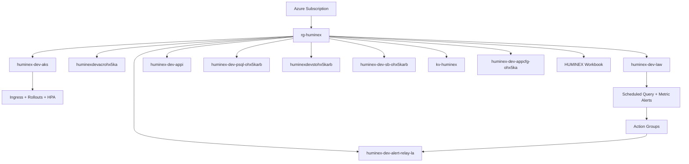

# Azure Resource Topology

```mermaid
flowchart TD
  SUB[Azure Subscription] --> RG[rg-huminex]

  RG --> AKS[huminex-dev-aks]
  RG --> ACR[huminexdevacrohx5ka]
  RG --> LAW[huminex-dev-law]
  RG --> APPI[huminex-dev-appi]
  RG --> PG[huminex-dev-psql-ohx5karb]
  RG --> STO[huminexdevstohx5karb]
  RG --> SB[huminex-dev-sb-ohx5karb]
  RG --> KV[kv-huminex]
  RG --> APPCFG[huminex-dev-appcfg-ohx5ka]
  RG --> LA[huminex-dev-alert-relay-la]
  RG --> WB[HUMINEX Workbook]

  AKS --> INGRESS[Ingress + Rollouts + HPA]
  LAW --> ALERTS[Scheduled Query + Metric Alerts]
  ALERTS --> AG[Action Groups]
  AG --> LA
```
