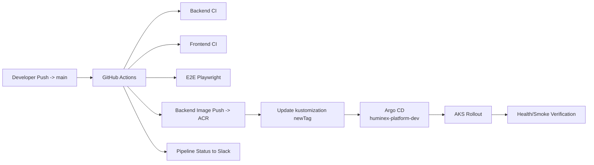

# CI/CD and GitOps Delivery

## Current workflow files

- `.github/workflows/backend-ci.yml`
- `.github/workflows/frontend-ci.yml`
- `.github/workflows/e2e-playwright.yml`
- `.github/workflows/backend-image-push.yml`
- `.github/workflows/codeql.yml`
- `.github/workflows/infra-deploy.yml`
- `.github/workflows/openhuman-backend-ci.yml`
- `.github/workflows/pipeline-status-slack.yml`
- `.github/workflows/project-overview-slack.yml`
