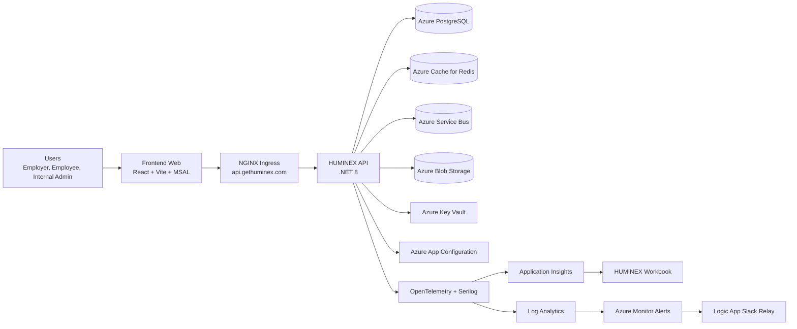

# High-Level Design

```mermaid
flowchart LR
  U[Users\nEmployer, Employee, Internal Admin] --> W[Frontend Web\nReact + Vite + MSAL]
  W --> I[NGINX Ingress\napi.gethuminex.com]
  I --> A[HUMINEX API\n.NET 8]

  A --> P[(Azure PostgreSQL)]
  A --> R[(Azure Cache for Redis)]
  A --> S[(Azure Service Bus)]
  A --> B[(Azure Blob Storage)]
  A --> K[Azure Key Vault]
  A --> C[Azure App Configuration]

  A --> O[OpenTelemetry + Serilog]
  O --> L[Log Analytics]
  O --> AP[Application Insights]

  AP --> WB[HUMINEX Workbook]
  L --> AL[Azure Monitor Alerts]
  AL --> LA[Logic App Slack Relay]
```
