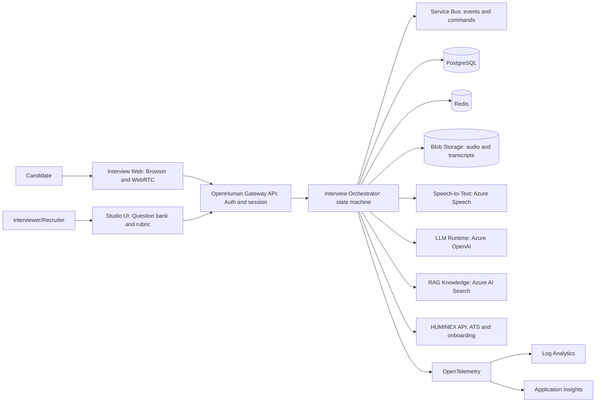

# OpenHuman High-Level Design

## Recommended AI stack (enterprise-grade)

- **Primary LLM provider**: Azure OpenAI (tenant-safe, private networking options, enterprise auth).
- **Models (recommended)**:
  - A "flagship" reasoning/chat model for interviewer agent + evaluation.
  - A smaller/faster model for classification, routing, redaction, and guardrails.
  - Optional realtime-capable model for low-latency interview interactions.
- **Agent runtime**:
  - Use a deterministic **workflow/orchestrator** for interview state (timeouts, retries, idempotency).
  - Keep LLM calls as tools invoked by the orchestrator, never as the source-of-truth state.
- **Safety**:
  - PII redaction before long-term storage, prompt/response logging with policy controls, strict RBAC.
